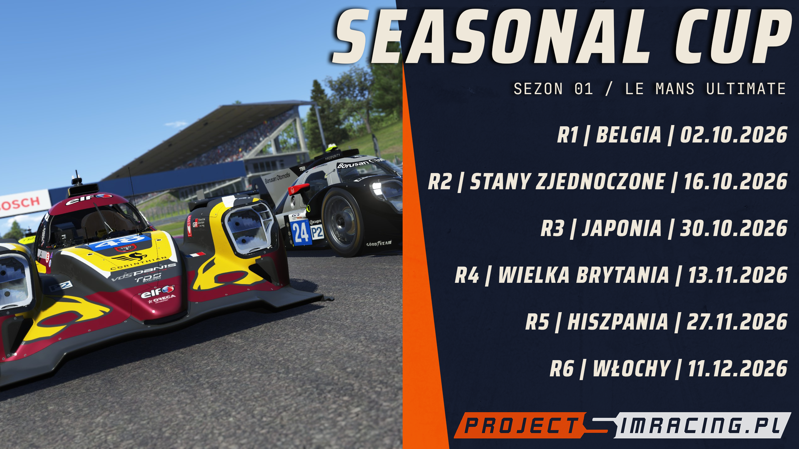

Sezon 0. był rozpoznaniem terenu. Pozwolił nam sprawdzić, jak w Le Mans Ultimate
działa system ligowy - co się w nim sprawdza, a co trzeba poprawić, zanim
zaprosimy do stawki więcej kierowców. **Seasonal Cup** jest jego następstwem:
pierwszym pełnym sezonem Project Simracing w tej grze, rozpisanym od początku
do końca.

## Sześć rund, start w Spa

Sezon to sześć głównych eventów. Każdy rozpoczyna się o 19:00, a przerwy
między wyścigam - tak jak w sezonie 0. - pozostają dwutygodniowe. Pierwszy
wyścig rusza już 2 października w Belgii, na torze Spa-Francorchamps.

| # | Runda | Termin |
|---|---|---|
| 1 | Belgia — Spa-Francorchamps | 2 października 2026, 19:00 |
| 2 | Stany Zjednoczone | 16 października 2026, 19:00 |
| 3 | Japonia | 30 października 2026, 19:00 |
| 4 | Wielka Brytania | 13 listopada 2026, 19:00 |
| 5 | Hiszpania | 27 listopada 2026, 19:00 |
| 6 | Włochy | 11 grudnia 2026, 19:00 |

Dwa tygodnie przerwy zostały ustalone tak, aby współpracowały z kalendarzem
sezonu WRC, oraz dać casualowym kierowcom więcej czasu na trening.

## Dwie klasy na torze

Seasonal Cup będzie sezonem multiklasowym. Obok znanej z sezonu 0. klasy
LMGT3 pojawia się LMP2 ELMS - dla tych, którym samo GT3 przez cały sezon
już nie wystarcza.

Na start liczba slotów w LMP2 jest ograniczona do dziesięciu. Chcemy zobaczyć,
jak wygląda balans między obiema klasami na torze i w wynikach, zostawiając
klasyczne GT3 wciąż w większości. Jeżeli chętnych na prototypy będzie więcej,
liczbę miejsc zwiększymy.

## Jak dołączyć

Do sezonu wchodzi się przez trzy rzeczy - wszystkie darmowe i zrobione raz:

1. Konto na [SimGrid](https://www.thesimgrid.com/).
2. Obserwowanie [community Project Simracing](https://www.thesimgrid.com/communities/project-simracing).
3. Połączone konto z [RaceControl](https://www.racecontrol.gg/).

Szczegóły eventów, obsady i zapisy znajdziesz na
[stronie sezonu na SimGrid](https://www.thesimgrid.com/championships/27647).

## Co dalej

Linki do zasad, community i samych eventów są na Discordzie, na kanałach
lmu-zasady i lmu-zapisy. Na dniach pojawi się tam zaktualizowany
regulamin z zapisami dotyczącymi wyścigów multiklasowych i kilkoma poprawkami,
które wyszły w sezonie 0. Pytania i sugestie do sezonu najlepiej
zostawić właśnie tam; postaramy się odpowiedzieć na wszystkie.

W międzyczasie pracujemy nad tabelami wyników i aktualizacjami, które zobaczycie
tutaj, na [projectsimracing.pl](https://projectsimracing.pl/) -
[terminarz](../../kalendarz.html) i [wyniki](../../wyniki.html) będą prowadzone
przez cały sezon.

Do zobaczenia w Spa.
