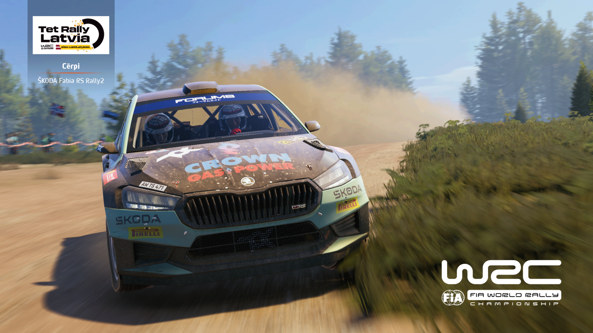
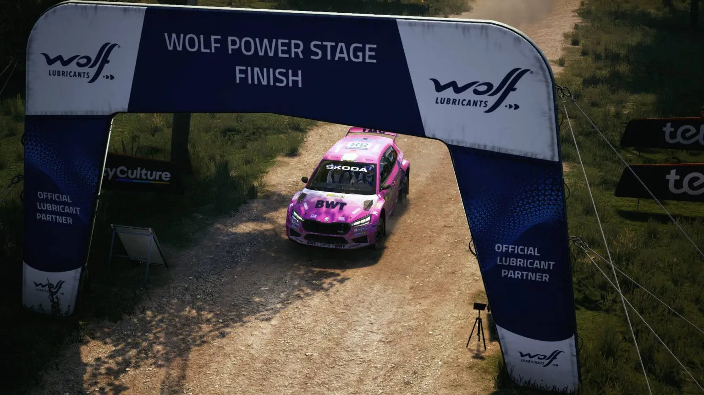

## Otwarcie finałowego sezonu

Wczesna jesień, tradycyjnie już, zwiastuje początek nowego sezonu EA Sports WRC w lidze Project Simracing. 15. sezon w rajdowych grach Codemasters organizowany przez polską ligę będzie jednak wyjątkowy - zawodnicy uhonorują swoimi startami ostatnie dzieło Codemasters w ostatnim oficjalnym sezonie ligi.

Administracja także dołożyła swoje trzy grosze, jeśli chodzi o wyjątkowość finałowego sezonu. Rajdy, w których zmierzą się kierowcy, zostały wybrane tak, aby dawały jak największą przyjemność z bardzo szybkiej jazdy. Uproszczono także regulamin, zakazując własnych ustawień samochodów. Tym razem wybór klasy odbył się spośród wszystkich klas dostępnych w grze, a ostatecznie większość postawiła na przystępne w prowadzeniu samochody **WRC2**.

## Szybko i po zmroku

Pierwszą rundą ostatniej kampanii był szybki Rajd Łotwy, rozgrywany przy dobrych warunkach i nieliczący zbyt wielu kilometrów oesowych. Podobnie jak w każdym rajdzie sezonu, na zawodników czekało 6 prób sportowych. Było jednak pewne utrudnienie - większość pierwszej pętli imprezy rozgrywana była po zachodzie słońca.

## Czołówka: Katana, Norbert, Letar

Nie sposób nie zacząć omawiania wyników sportowych od przypomnienia o dobrze znanym w simracingowej społeczności Michale „Katanie” Królu. Ze względu na gościnne starty w poprzednim sezonie nie liczył się on w walce o „generalkę”, wahał się także, jeśli chodzi o regularną jazdę w ostatnim sezonie. Postanowił jednak pojawić się na starcie pierwszej rundy za kierownicą Skody Fabii i - zgodnie z oczekiwaniami społeczności - wygrał ją, po drodze zgarniając zwycięstwa na wszystkich odcinkach specjalnych, w tym na dodatkowo punktowanym Power Stage.

Michał podzielił się swoimi wrażeniami w formie krótkiej rozprawki. Przyznał, że nie przepada za łotewskimi szutrami, ale przesiadka na nowy sprzęt dodała mu pewności siebie. Zapowiedział też, że zamierza wystartować we wszystkich rundach sezonu - choć skromnie zauważył, że nie liczy na wygranie wszystkich rajdów, tak jak zrobił to w Sezonie 13.

Formę z poprzedniego sezonu zdaje się doskonale przekładać Norbert, który zajął na Łotwie drugą pozycję. Kierowca Toyoty Yaris nie stracił wiele - jego strata do Katany wyniosła tylko 7 sekund. Takie tempo zapowiada, że Norbert może być jednym z głównych pretendentów do rzucenia Michałowi rękawicy w walce o zwycięstwo w klasyfikacji PSR1.

Podium pierwszego rajdu uzupełnił powracający po przerwie Letar, dla którego jest to naturalnie najlepszy wynik w ligowej karierze. Jak przyznał, sporą część poprzedniego sezonu, zamiast na startach, spędził na szlifowaniu formy. Przyniosło to efekt - prowadził w rajdzie aż do pojawienia się na starcie pierwszej dwójki. Letar zdobył także najwięcej punktów w dywizji Rookie.

## Od czwartego do dziesiątego miejsca

Skoro mowa o klasyfikacji Rookie, to czwarte miejsce w Rajdzie Łotwy zajął jej zwycięzca z poprzedniego sezonu, a więc Krystyniaczek, awansowany do PSR1 w obecnie trwającym sezonie. Do podium zabrakło mu zaledwie pięciu sekund, można więc zakładać, że szanse na „pudło” w nadchodzących rundach są wysokie.

Miejsca 5-7 zostały „obstawione” przez kierowców teamu RacersPL. Piąte miejsce zajął Thoma, którego forma jest tak samo wysoka jak przez większą część poprzedniego sezonu. Kilkanaście sekund za nim na mecie zameldował się szósty w „generalce” MaxxeR, który wydaje się bardzo dobrze czuć w autach klasy WRC2. Trójkę kierowców teamu zamknął AdamRacer, który dodał kolorytu pierwszej dziesiątce za sprawą startu samochodem innym niż Fabia i Yaris - siódme miejsce wywalczył za kierownicą leciwego Volkswagena Polo.

Ósma pozycja należała do Wolfa, który do samego końca poprzedniego sezonu walczył z cAst0rem o zwycięstwo w klasyfikacji PSR2. W tym sezonie szansa na to będzie większa, bo wyjechał z Łotwy jako lider „drugiej ligi”.

Po dobrym jednorazowym występie na sam koniec Sezonu 14. do rywalizacji wrócił **Kori**, który zajął na Łotwie dziewiątą pozycję. Znalazł on jednak wiele sprytnych wytłumaczeń dla swojego wyniku. Po pierwsze - wyznał, że nie lubi szybkich rajdów; administracja ma nadzieję, że spojrzał w kalendarz Sezonu 15. Po drugie - ma problemy z widocznością po zmroku, co przeszkodziło mu w osiągnięciu dobrego wyniku, za co nie omieszkał wyrazić rozczarowania organizatorami. Największą przeszkodą w uzyskaniu ósmej pozycji okazał się „niespodziewanie” dobry wynik Michała Króla, którego Kori ma nadzieję pokonać w Grecji - tam spędzi na treningach najbliższe dwa tygodnie.

Dziesiątkę zamknął ligowy debiutant, kierowca o nicku **rallycelica**. Obok dobrego wyniku w pierwszym występie należy odnotować, że mimo statusu debiutanta zdobywa on punkty do klasyfikacji PSR1.

| Miejsce | Kierowca |
|---|---|
| 1. | Michał „Katana” Król |
| 2. | Norbert |
| 3. | Letar |
| 4. | Krystyniaczek |
| 5. | Thoma |
| 6. | MaxxeR |
| 7. | AdamRacer |
| 8. | Wolf |
| 9. | Kori | 
| 10. | rallycelica |

## Druga dziesiątka

Tuż za TOP10 znalazł się now_ikk, zwycięzca klasyfikacji PSR3 z poprzedniego sezonu. Jego forma zdaje się jeszcze rosnąć - mimo awansu o dywizję wyżej zajął drugą pozycję w PSR2. 12. miejsce to Cheetack, który bardzo dobrze spisywał się w drugiej połowie poprzedniego sezonu, osiągając najlepsze wyniki w rajdach asfaltowych. Kolejnym debiutantem w ligowych zmaganiach był Kaczy, który od razu zaprezentował się z dobrej strony, meldując się na mecie jako trzynasty. Po przerwie pod koniec poprzedniego sezonu z przytupem wrócił do rywalizacji Harwester, zajmując 14. lokatę.

15. miejsce należało do zwycięzcy „generalki” Sezonu 14. - Tomasza Ciborka. Pokerowa zagrywka z brakiem zapasowych opon nie opłaciła się Tomkowi: przebił jedną z nich, wjeżdżając do rowu. Znając jednak jego tempo, na pewno zrehabilituje się przy pierwszej możliwej okazji.

16. pozycja to kolejny mocny ligowy debiut - Godzio. 17. był Młynson, który jako jeden z niewielu zdecydował się na konstrukcję inną niż dwie najpopularniejsze i dobry wynik wywalczył za kierownicą Forda Fiesty. 18. miejsce należało do Olexa, który startuje w lidze od bardzo wielu sezonów i niezależnie od klasy potrafi solidnie zapunktować, zawsze dowożąc wynik do mety. 19. Martinez przebił swoim wynikiem wszystkie rezultaty z Sezonu 14. Dwudziestkę zamknął Skuciu, dla którego także był to pierwszy ligowy występ.

## Klasyfikacja zespołowa

Do rywalizacji zespołowej w finałowym sezonie zgłosiło się **11 ekip**. Niektóre pozostały w dotychczasowych składach, inne nieco zmieniły kierowców, a jeszcze inne powstały „od zera”.

| Miejsce | Zespół | Kierowcy (miejsce w rajdzie) |
|---|---|---|
| 1. | RacersPL | Thoma (5.), MaxxeR (6.), AdamRacer (7.) |
| 2. | Maczeta Racing | Letar (3.), Cheetack (12.), Godzio (16.) |
| 3. | SRC | Norbert (2.), daro (21.) |
| 4. | AdBlue Rally Team | Wolf (8.), Kaczy (13.), Shieryff (37.) |
| 5. | Almost Pro Rally Team | now_ikk (11.), RedDevil (27.), PawełK (32.) |
| 6. | Purple Sector | DEVMAR (22.), DAF_TORO_ROSSO (24.), ValtteriB (29.) |
| 7. | MEGA WACKI | Martinez (19.), Babuch (33.), JacekR (50.) |
| 8. | ODCINA | Switch (26.), Xalion (47.), Liscypis (48.) |
| 9. | Automobilklub Chełmski | Patryk Sahadel (28.), FOXuuu (34.), old_max (46.) |
| 10. | Lewy-3-Drzewo | Patrickyo (36.), fozzgen (40.), Captain Slow (41.) |
| 11. | Instinct Motorsport | Chad_MC (39.), artur (42.), pawlakki (43.) |

Wśród tych, którzy pozostali w niezmienionym składzie, znalazł się team **RacersPL**. Po drugim miejscu w „generalce” poprzedniego sezonu postawili sobie poprzeczkę jeszcze wyżej i to oni wygrali zespołowo Rajd Łotwy. Thoma, MaxxeR i AdamRacer zajęli miejsca od piątego do siódmego, co przełożyło się na odpowiednio 38, 35 i 33 punkty. Wyjeżdżają tym samym z Łotwy jako liderzy klasyfikacji zespołowej.

Druga pozycja należała do zupełnie nowego teamu w stawce. Sprytni odgadną, z jakiego miasta pochodzą kierowcy zespołu **Maczeta Racing**. Liderem zespołu jest na tę chwilę Letar, który za trzecią lokatę w rajdzie i na Power Stage zdobył 42 pkt. Kolejnym zawodnikiem był 12. Cheetack, który zasilił teamowe konto o 24 pkt. Debiutujący Godzio także przyczynił się do miejsca zespołu na podium, zdobywając 20 punktów.

Podium Rajdu Łotwy uzupełnili zawodnicy zwycięskiego w poprzednim sezonie teamu **SRC**. Zaszła jednak ważna zmiana: startujący od dawna w lidze Gościu musiał zrezygnować ze startów, a jego miejsce w zespole zajął Crift. Ostatecznie na starcie pojawiła się dwójka zawodników: Norbert, który zdobył aż 50 pkt, oraz dobrze znany w lidze daro, który tym razem zajął 21. lokatę, za co należało mu się 15 „oczek”.

Czwarta pozycja to **AdBlue Rally Team**, także startujący w lekko zmienionym składzie. Jarkus póki co nie rywalizuje już w lidze, ale znaleziono za niego godne zastępstwo. Najwyżej punktującym był 8. na mecie Wolf, który zdobył 31 pkt. Nowym zawodnikiem zespołu został Kaczy, który bardzo dobrze otworzył sezon, zdobywając 23 pkt za 13. pozycję. Shieryff dojechał do mety na odległej, 37. pozycji, czym zasilił konto zespołu o 1 pkt.

Piąta lokata należała do kolejnego nowego zespołu, **Almost Pro Rally Team**. Najwyżej punktującym zawodnikiem był 11. na mecie now_ikk (25 pkt). 27. na mecie znalazł się RedDevil, znany wcześniej jako Electrician. 32. pozycję zajął PawełK, za co zdobył 4 pkt.

Szóste miejsce to kolejny z nowych teamów, choć pod widzianą wcześniej w lidze nazwą - **Purple Sector**. Mimo że zarówno DEVMAR, jak i DAF_TORO_ROSSO napotkali problemy na trasie, zdołali dość solidnie zapunktować, zdobywając odpowiednio 14 i 12 pkt za 22. i 24. miejsce. Wolniejszym tempem do mety dojechał 29. ValtteriB, który zdobył 7 pkt.

Siódme miejsce należało do także nowego zespołu, startującego pod nazwą **MEGA WACKI**. W skład teamu wchodzą Martinez, 19. na Łotwie (17 pkt), Babuch, który dojechał do mety na 33. miejscu i powiększył zespołowy dorobek o 3 pkt, oraz JacekR, który dojechał do mety z dużą stratą i za 50. lokatę zdobył 1 pkt.

Dla odmiany **ODCINA** to zespół, który od wielu sezonów nie zmienia składu - i to oni znaleźli się na Łotwie na ósmej pozycji. Najlepiej z kierowców poradził sobie Switch, który dojechał do mety na 26. miejscu i zapisał na konto teamu 10 pkt. Xalion i Liscypis nie dopiszą Rajdu Łotwy do udanych - ukończyli go na odpowiednio 47. i 48. miejscu i zdobyli po punkcie.

Dziewiąte miejsce to biorący udział w rywalizacji od poprzedniego sezonu **Automobilklub Chełmski**. Patryk Sahadel ukończył Rajd Łotwy na 28. pozycji, za co należało mu się 8 pkt. 34. na mecie znalazł się powracający do rywalizacji FOXuuu, ale taki wynik dał zaledwie 2 pkt. 46. old_max wzmocnił dorobek zespołu jednym punktem.

Kiepski start sezonu zaliczył team **Lewy-3-Drzewo**. Najwięcej, bo 3 punkty, zdobył Patrickyo, który mimo 36. pozycji w rajdzie popisał się czwartym czasem na Power Stage. 40. fozzgen zdobył 1 pkt. Nawet wracający po długiej przerwie Captain Slow nie udźwignął trudów rajdu - finiszował tuż za fozzgenem i podobnie jak on powiększył dorobek zespołu tylko o jeden punkt. Można się jednak spodziewać znacznej poprawy już w kolejnej rundzie.

Ostatnim zespołem premierowego rajdu sezonu był **Instinct Motorsport**. Wszyscy kierowcy dojechali do mety, ale wysoki poziom stawki pozwolił 39. Chadowi_MC, 42. arturowi i 43. pawlakki zdobyć łącznie trzy punkty. Kierowcy mieli jednak dobre występy w poprzednim sezonie, więc można liczyć na poprawę w nadchodzących rundach.

## Co dalej

Czas na chwilę zwolnić tempo. Drugą rundą Sezonu 15. będzie wymagający **Rajd Grecji**. Terminy kolejnych rund są w [kalendarzu](../../kalendarz.html), a pełne wyniki Rajdu Łotwy - w [zakładce wyników](../../wyniki.html).
