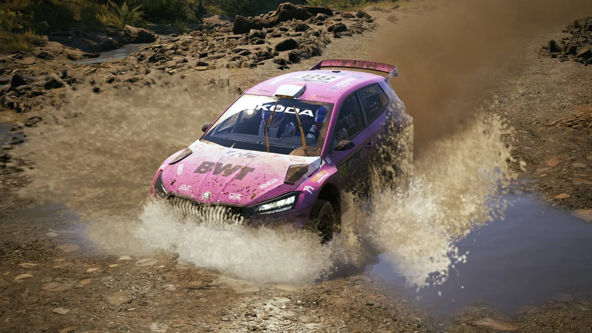
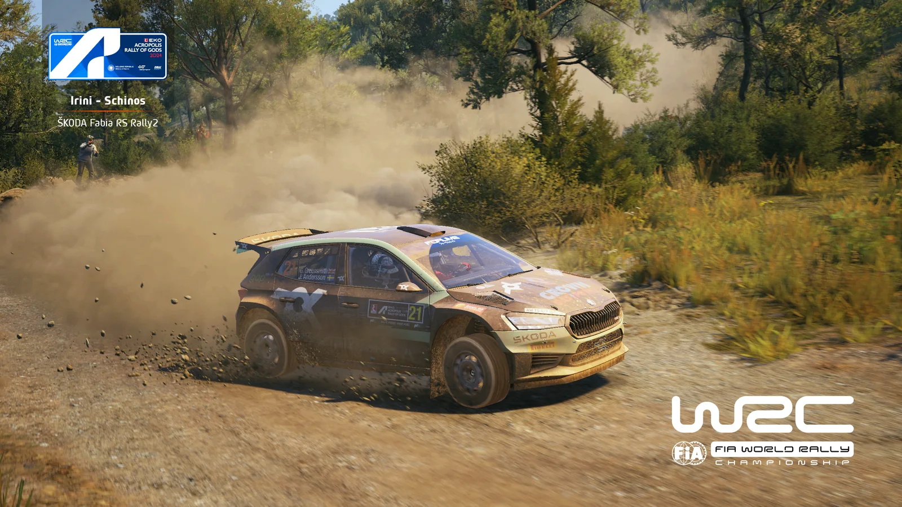
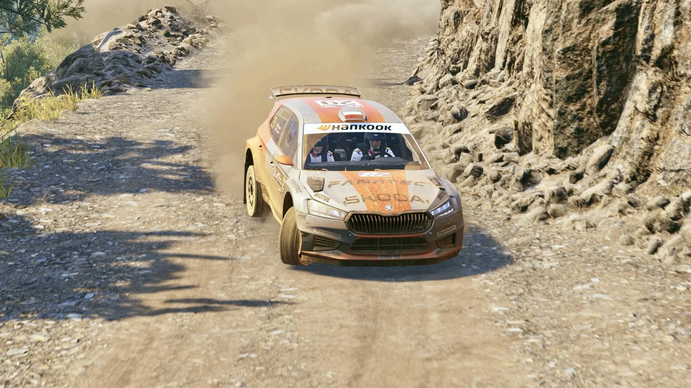

15. sezon ligi EA Sports WRC zaczął się niewinnie. W pierwszej rundzie zawodnicy zmierzyli się z Rajdem Łotwy, który uchodzi za stosunkowo przyjemną do jazdy rundę - wszystko ze względu na dość proste odcinki specjalne, na których mogli uzyskiwać wysokie prędkości. Jedynym utrudnieniem była pora rozegrania pierwszej pętli, bowiem odbywała się ona po zachodzie słońca.

Bardzo szybko przyszedł jednak czas, aby nieco zwolnić tempo. Drugim rajdem pożegnalnego sezonu była runda z oesami położonymi wokół Akropolu, a więc Rajd Grecji. Pogoda jak zwykle w tym rejonie dopisała, ale nie oznaczało to, że na zawodników czeka „spacerek”. Rajd Grecji znany jest z wysokiego poziomu trudności ze względu na dużą liczbę podjazdów i nawrotów, a przede wszystkim strome zbocza, spadnięcie z których może w jednej chwili przekreślić marzenia o dobrym wyniku.

## Podium: Katana, AdamRacer, Norbert

Oczy wszystkich zwrócone były na Michała Króla, który po powrocie na prawdopodobnie pełny sezon nie pozostawił reszcie stawki szans podczas pierwszej rundy. Rajd Grecji zapowiadał się jako znacznie trudniejsze wyzwanie dla lidera klasyfikacji, ponieważ przystępował do niego z problemami zdrowotnymi. Jak wspomniał, zmobilizował wszystkie siły na przejazd sześciu oesów i ponownie przyniosło mu to zwycięstwo w kolejnym rajdzie ligi Project Simracing! Swój wynik przypieczętował najlepszym czasem na Power Stage i to Michał wyjeżdża z Grecji jako lider, z kompletem możliwych do zdobycia punktów.

AdamRacer tym razem zrezygnował ze startu leciwym Volkswagenem Polo R5 i, podobnie jak cała czołówka, wsiadł za kierownicę Skody Fabii Rally2. Taki ruch przyniósł natychmiastową poprawę tempa i to Adam zajął w Grecji drugą lokatę, a dodatkowe 3 pkt za Power Stage pozwalają mu, obok znakomitego wyniku w całej imprezie, awansować na trzecią pozycję w klasyfikacji generalnej.

Po raz drugi z rzędu na podium uplasował się także Norbert. Walka była naprawdę zacięta, ponieważ całe podium Rajdu zmieściło się w zaledwie jedenastu sekundach mimo tego, że przejazd całego dystansu trwał prawie 40 minut. Norbertowi do powtórzenia wyniku z Łotwy zabrakło tylko czterech sekund, ale ponowna wizyta na podium pozwala mu na utrzymanie drugiej lokaty w klasyfikacji PSR1 z jedenastopunktową stratą do prowadzącego od początku Michała „Katany”.

## Od czwartego do dziesiątego miejsca

Z pierwszą dużą stratą czasową w porównaniu do podiumowiczów na mecie zameldował się czwarty Tomasz Ciborek. Zwycięzca poprzedniego sezonu zmagał się z problemami na pierwszej pętli, a na domiar złego przebił oponę na czwartym oesie. Odnalazł jednak tempo na sam koniec i dopisał do swojego dorobku 39 pkt.

Piąte miejsce zajął Kori, który jednak nie spędził ostatnich dwóch tygodni na treningach. Podszedł za to do Rajdu Grecji z szacunkiem, podkreślając w wypowiedziach poziom trudności odcinków specjalnych.

Na szóstym miejscu uplasował się now_ikk, który odniósł pierwsze zwycięstwo w klasyfikacji PSR2. Dało mu to awans na pierwsze miejsce w dywizji i sporą przewagę nad dotychczasowym liderem, Wolfem, który w Grecji zajął dopiero 33. miejsce.

Dobrą formę utrzymuje krystyniaczek, który po czwartym miejscu na Łotwie tym razem znalazł się na siódmej pozycji. Warto zaznaczyć, że do podium klasyfikacji PSR1 traci tylko 3 punkty. Znacznie lepiej niż podczas szybkiego otwarcia sezonu spisał się w Akropolu daro - ligowy weteran zajął w Grecji ósme miejsce i mocno poprawił dorobek punktowy swojego teamu. MaxxeR utrzymuje dobrą dyspozycję, kończąc drugi rajd w drugiej połowie pierwszej dziesiątki.

TOP10 zamknął Letar. Jego wynik byłby znacznie lepszy, wszak pokazał już, że potrafi mieć bardzo mocne tempo. Szanse na lepszy rezultat przekreślił czwarty odcinek specjalny, na którym przebił oponę, co spowodowało kolejne uszkodzenia.

| Miejsce | Kierowca |
|---|---|
| 1. | Michał „Katana” Król |
| 2. | AdamRacer |
| 3. | Norbert |
| 4. | Tomasz Ciborek |
| 5. | Kori |
| 6. | now_ikk |
| 7. | krystyniaczek |
| 8. | daro |
| 9. | MaxxeR |
| 10. | Letar |

## Klasyfikacja zespołowa

Trudne warunki i kamienista nawierzchnia zwiastowały możliwe przetasowania wśród teamów po pierwszej rundzie sezonu. Rajd Grecji zgodnie z oczekiwaniami przyniósł kilka niespodzianek w klasyfikacji zespołowej.

| Miejsce | Zespół | Kierowcy (miejsce w rajdzie) |
|---|---|---|
| 1. | SRC | Norbert (3.), daro (8.), Crift (11.) |
| 2. | RacersPL | AdamRacer (2.), MaxxeR (9.), Thoma (24.) |
| 3. | Maczeta Racing | Letar (10.), Cheetack (18.), Godzio (20.) |
| 4. | Purple Sector | DAF_TORO_ROSSO (12.), DEVMAR (15.), ValtteriB (nie ukończył) |
| 5. | Almost Pro Rally Team | now_ikk (6.), PawełK (37.), RedDevil (42.) |
| 6. | Lewy-3-Drzewo | Patrickyo (14.), fozzgen |
| 7. | Instinct Motorsport | artur (25.), pawlakki (26.), Chad_MC (35.) |
| 8. | AdBlue Rally Team | Shieryff (23.), Wolf (33.), Kaczy (34.) |
| 9. | Automobilklub Chełmski | Patryk Sahadel (19.), old_max (bez czasu) |
| 10. | MEGA WACKI | Babuch (27.), JacekR (39.), Martinez (43.) |
| 11. | ODCINA | Xalion (28.) |

Mimo zwycięstwa w pierwszej rundzie team RacersPL musiał mieć się na baczności, bowiem kierowcy zwycięskiego w poprzednim sezonie SRC nie pokazali na Łotwie pełni swoich możliwości. Ta sztuka udała im się w Grecji, gdzie SRC odniosło pierwsze zwycięstwo w sezonie, pokonując drugi team o 12 pkt. Wszyscy zawodnicy spisali się naprawdę dobrze. Trzeci Norbert dzięki dodatkowym punktom za Power Stage zdobył łącznie 46 „oczek”. Wspomniany daro po dobrym rajdzie wzmocnił konto punktowe o 31 pkt. Do rywalizacji niespodziewanie powrócił Crift, który z marszu uplasował się na 11. pozycji, za co należało mu się 25 pkt.

Team RacersPL nie składa jednak broni i mimo że tym razem do zwycięstwa zabrakło kilkunastu punktów, bez większego wysiłku zajęli w Grecji drugą lokatę, zdobywając łącznie aż 90 pkt. Doskonałe 49 pkt Adama zapewniło mocną zaliczkę dla reszty. Dziewiąty MaxxeR przywiózł do mety 29 pkt. Mimo słabszego tym razem wyniku Thomy, który zdobył 12 pkt za 24. miejsce, zespół utrzymuje się na prowadzeniu „generalki” z 29-punktową przewagą.

Z podium od początku nie schodzi także trzeci team klasyfikacji - Maczeta Racing. Podobnie jak ostatnio, najszybszym z reprezentantów Miasta Królów Polskich okazał się Letar. W drugiej połowie drugiej dziesiątki, tak samo jak na Łotwie, znaleźli się Cheetack i Godzio, zdobywając odpowiednio 19 i 16 pkt za 18. i 20. miejsce.

Czwarta lokata w prawdopodobnie najtrudniejszym rajdzie sezonu należała do Purple Sector. „Purpurowi” osiągnęli wynik tuż za podium, dojeżdżając do mety we dwójkę. 12. pozycję zajął DAF_TORO_ROSSO, za co zdobył 24 pkt. Niedaleko za nim, na 15. miejscu, uplasował się DEVMAR z dorobkiem 21 pkt. Problemy techniczne wyeliminowały Valtteriego z rywalizacji pod sam koniec pierwszej pętli.

Na piątym miejscu znaleźli się zawodnicy Almost Pro Rally Team. Wynik w górnej połowie stawki osiągnęli głównie za sprawą doskonałej jazdy now_ikka, który zdobył 35 pkt. Słabiej tym razem wypadli PawełK oraz RedDevil, którzy, korzystając z systemu SupeRally, uplasowali się na 37. i 42. pozycji. Dojechali jednak do mety, za co należało im się po punkcie.

Szósta lokata w Grecji to Lewy-3-Drzewo. Mimo dwuosobowego, podobnie jak w poprzednim sezonie, składu zdobycz punktowa była o wiele lepsza niż na otwarcie sezonu. 14. miejsce zajął Patrickyo, który za swój występ „zgarnął” 22 punkty. 15 „oczek” zdobył fozzgen, który tym razem wystartował na treningu, co - jak widać - przyniosło efekt, mimo drobnych problemów na trasie. Dobry wynik oznacza awans na 7. miejsce w „generalce”.

Zawodnicy Instinct Motorsport po ostatnim miejscu na Łotwie na poważnie wzięli się do pracy i to oni zajęli 7. pozycję w Grecji. O kolejności artura i pawlakki na mecie zadecydowało dosłownie mrugnięcie. Ten pierwszy uplasował się na 25. miejscu z dorobkiem 11 pkt, a pawlakki dojechał do mety wolniej o mniej niż sekundę, co oznaczało 10 pkt. Chad_MC korzystał z systemu SupeRally i za 35. pozycję zdobył 1 pkt.

Dużo słabiej niż na Łotwie spisał się za to ósmy AdBlue Rally Team. Najwięcej punktów przywiózł do mety 23. Shieryff, który dopisał do swojego wyniku 13 „oczek”. Obok siebie na mecie znaleźli się 33. Wolf oraz 34. Kaczy, którzy zdobyli odpowiednio 3 i 2 punkty. Słabszy wynik nie oznacza jednak wypadnięcia z walki, bowiem AdBlue zajmuje obecnie 6. miejsce w klasyfikacji sezonu.

Nieco lepszą formę niż na Łotwie pokazał Automobilklub Chełmski, mimo tylko jednego zawodnika na mecie. Dziewiąta lokata to zasługa Patryka Sahadela, który zajął 19. pozycję i wyjechał z Grecji z siedemnastoma punktami. Pechowo zakończył się start old_maxa, który mimo przejechania wszystkich oesów, wskutek błędu technicznego nie miał zapisanego czasu.

Przedostatnie miejsce zajął team MEGA WACKI. Najlepszym z nich był Babuch, który ukończył rywalizację na 27. pozycji i zdobył tym samym 9 pkt. JacekR oraz Martinez nie podołali trudom Rajdu Grecji i uplasowali się na 39. i 43. miejscu, za co zdobyli po punkcie.

11. miejsce tym razem przypadło ODCINIE. Osamotniony Xalion dojechał do mety na 28. pozycji, czym przynajmniej odbił sobie kiepski występ na Łotwie.

## Co dalej

Po chwili przerwy od wysokich prędkości kierowcy muszą błyskawicznie wrócić do szybkiej jazdy. Trzecią rundą ostatniego sezonu będzie Rajd Finlandii, rozgrywany na mokrej nawierzchni.
