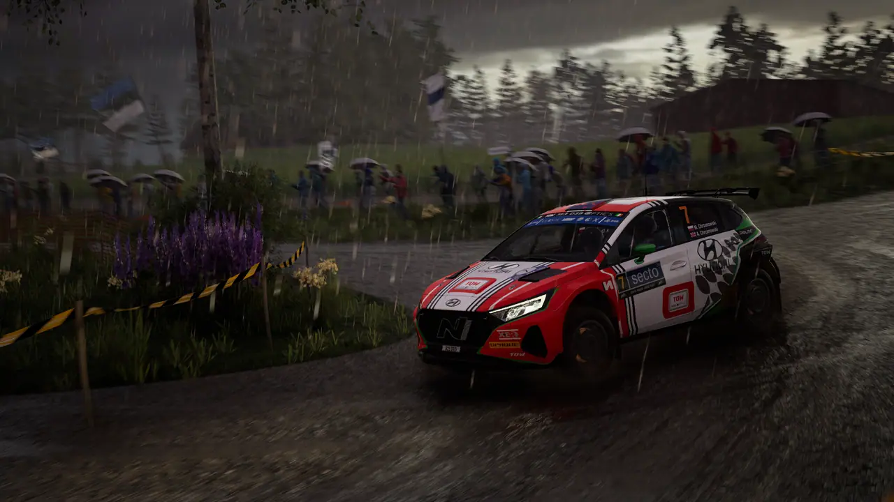
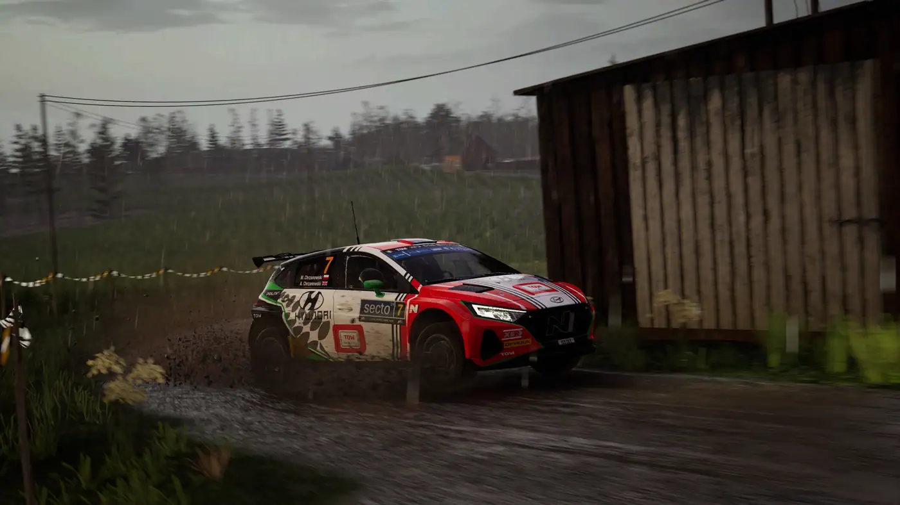

Sezon 14. dobiegł końca. Zawodnicy, za kierownicą samochodów klasy WRC+,
zmierzyli się w nim z każdymi możliwymi warunkami — od spokojnej Chorwacji
po wymagający dla aut Rajd Safari.

## Finał w liczbach

Ostatnie zawody sezonu odbyły się przy dobrej pogodzie i rozegrane były
w standardowej, **sześcioodcinkowej** formule. Rajd nie należał jednak do
najłatwiejszych — szuter Sardynii nie wybacza.

- Zwycięzca rundy: **AdamRacer**, przewaga 12,9 s
- Najszybszy odcinek: *Zibiman96*
- Najwięcej punktów w sezonie: Team SRC

### Punktacja rundy

| Miejsce | Punkty | Bonus |
|---|---|---|
| 1. | 25 | +2 za najszybszy odcinek |
| 2. | 18 | — |
| 3. | 15 | — |

> Sardynia zawsze rozstrzyga sezon. W tym roku zrobiła to w ostatnim
> odcinku, i to o niecałe trzy sekundy.

## Co dalej

Sezon 15. rusza we wrześniu — [zapisy są już otwarte](https://forms.gle/djYKmgeQmg75uitF9).
Szczegóły terminarza znajdziesz w [kalendarzu](../../kalendarz.html).
