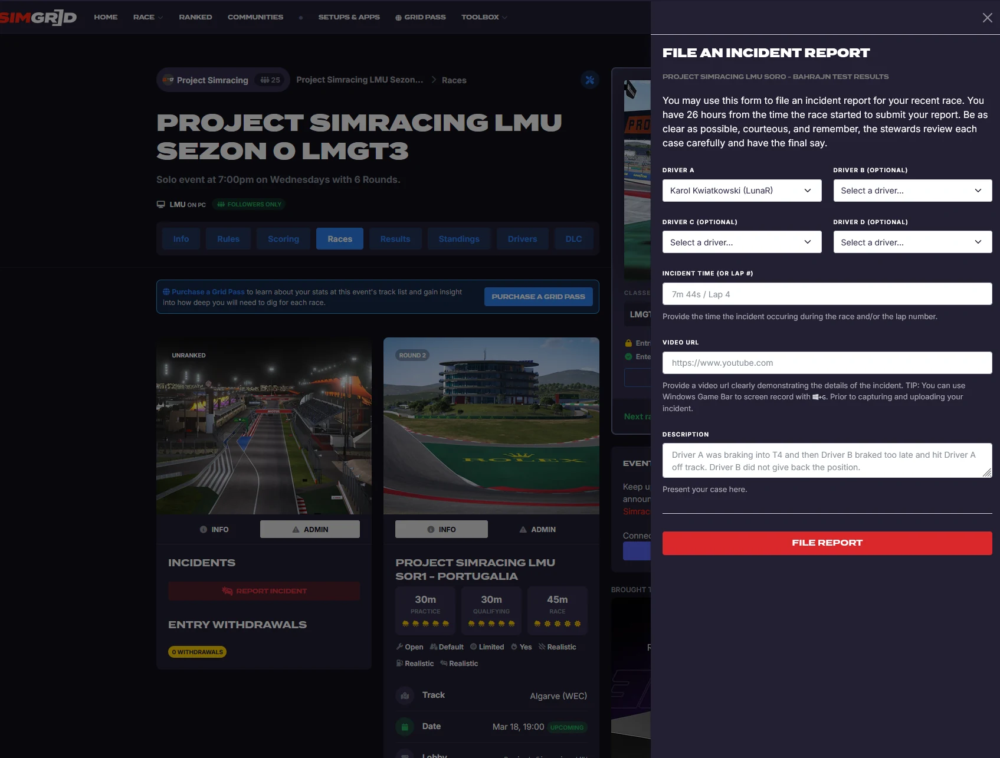

Regulamin obowiązuje we wszystkich wydarzeniach ligi Le Mans Ultimate organizowanych przez Project Simracing, w tym w **Seasonal Cup - sezon 1**.

## I. Organizator

Administracja serwera Discord, fanpage'u, grupy facebookowej oraz strony internetowej Project Simracing.

## II. Cele ligi

1. Umożliwienie rywalizacji oraz integracji graczom Le Mans Ultimate reprezentującym dowolny poziom doświadczenia.
2. Propagowanie simracingu.

## III. Warunki uczestnictwa

1. Zawody przeznaczone są dla wszystkich graczy posiadających grę Le Mans Ultimate.
2. Kierowcy mogą zgłaszać chęć udziału w mistrzostwach poprzez serwer Discord ligi Project Simracing, na kanale **#lmu-zapisy**.
3. Warunkiem uczestnictwa jest:
   - posiadanie konta w serwisie [SimGrid](https://www.thesimgrid.com/),
   - śledzenie [społeczności Project Simracing](https://www.thesimgrid.com/communities/project-simracing) w serwisie SimGrid,
   - połączenie konta z serwisem [RaceControl](https://www.racecontrol.gg/),
   - dołączenie do aktualnego wydarzenia w serwisie SimGrid, jeżeli trwa.
4. Aktualne informacje, linki do wydarzeń oraz zmiany regulaminu publikowane są na Discordzie, na kanałach **#lmu-zasady** i **#lmu-zapisy**.

## IV. System rozgrywek

### 1. Struktura sezonu

1. Każdy sezon główny składa się z minimum 5 głównych wyścigów. Sezony poboczne składają się z minimum 3 głównych wyścigów.
2. Długości czasowe poszczególnych wyścigów ustalane są na podstawie preferencji wynikających z ankiety przedsezonowej oraz decyzji zarządców ligi.
3. Warunki pogodowe ustalane są w analogiczny sposób. W ramach minimalnej liczby wyścigów w sezonie (5 rund) maksymalnie jeden wyścig może odbywać się w warunkach deszczowych. Dla eventów pobocznych warunek pogodowy nie obowiązuje i wszystkie wyścigi mogą odbywać się na sucho.
4. Informacje dotyczące dat, ustawień, dostępnych asyst oraz warunków pogodowych będą dostępne na stronie danego wydarzenia (eventu) w serwisie SimGrid.
5. Informacje na temat wymaganych DLC będą również zamieszczone na stronie eventu w serwisie SimGrid.
6. Terminarz sezonu publikowany jest także w [kalendarzu na projectsimracing.pl](../../kalendarz.html). Godziny startów podawane są w czasie polskim.

### 2. Ustawienia serwera i dołączanie

Do serwera wyścigowego można dołączyć na dwa sposoby: poprzez wpisanie kodu lobby lub poprzez wyszukanie serwera na liście i podanie hasła przy dołączaniu do sesji. Nazwa serwera, hasło oraz kod lobby będą każdorazowo udostępniane na kanale Discord **#SerwerLMU**.

Ustawienia serwera są jednakowe dla każdego wyścigu i obejmują:

- czas oczekiwania przed rozpoczęciem okrążenia formującego: 90 sekund,
- prywatne kwalifikacje,
- maksymalna liczba slotów: 38,
- otwarte setupy (dowolne ustawienia pojazdu),
- realistyczne i domyślne ustawienia zużycia paliwa oraz nagumowania toru,
- koce grzewcze włączone,
- realistyczny poziom uszkodzeń,
- standardowe limity toru - po przekroczeniu 4 punktów karnych kierowca otrzymuje karę drive-through,
- dozwolone wszystkie asysty z wyjątkiem: wspomagania sterowania, niewrażliwości, opposite lock oraz spin recovery.

Zużycie opon ustalane jest osobno dla każdego toru. Jeżeli w danym wyścigu jest ono zwiększone, zawodnicy zostaną o tym poinformowani w informacjach dotyczących wyścigu na stronie wydarzenia w serwisie SimGrid.

### 3. Klasy pojazdów

1. Klasa pojazdów oraz lista torów ustalane są przed rozpoczęciem sezonu.
2. Klasą podstawową dla głównych sezonów jest LMGT3.
3. Decyzję o przeprowadzeniu sezonu multiklasowego podejmuje Organizator przed sezonem, biorąc pod uwagę:
   a) ogólną liczbę zawodników przystępujących do sezonu - orientacyjnie 30 graczy lub więcej,
   b) decyzję graczy co do jednej lub wielu klas, podjętą na podstawie ankiety,
   c) decyzję graczy co do wyboru drugiej klasy.
4. Zasady obowiązujące w sezonach multiklasowych opisuje rozdział V.

### 4. Pojazdy i identyfikacja kierowców

1. Zmiana pojazdu jest dopuszczalna do końca drugiej rundy sezonu, nie później niż do godziny 20:00 dnia, w którym runda się odbywa. Warunek ten nie stosuje się do sezonów pobocznych. Zmianę klasy reguluje pkt V.2.
2. W przypadku zmiany pojazdu poza wyznaczonym limitem czasowym SimGrid automatycznie przyznaje dyskwalifikację. W takim przypadku należy zgłosić się do zarządcy z prośbą o przywrócenie oraz zmianę auta (jeżeli potrzebna). Jeżeli nowy pojazd należy do tej samej klasy, kierowca zachowuje połowę zdobytych dotychczas punktów. Jeżeli należy do innej klasy, punkty w nowej klasie liczone są od zera (pkt V.2).
3. Kierowca zobowiązany jest do startowania pod jednym, stałym nickiem lub imieniem i nazwiskiem zadeklarowanym w grze bądź w serwisie SimGrid, aby uniknąć konfliktów z późniejszą klasyfikacją wyników.
4. Jeżeli dyskwalifikacja lub utrata punktów wynika z błędu serwisu SimGrid albo błędu organizatorów, kierowca może złożyć odwołanie. Odwołania rozpatrywane są prywatnie przez zarządców ligi, którzy rozwiązują problem albo podtrzymują decyzję.

### 5. Procedura wracania do boksów

1. Podczas sesji publicznych (kwalifikacje i wyścig) kierowca chcący wrócić do boksu zobowiązany jest zjechać do alei serwisowej (pitlane), a następnie, będąc w strefie serwisowej, wycofać się do swojego boksu.
2. Powyższa procedura nie obowiązuje podczas sesji prywatnych oraz treningów.

### 6. Awarie serwera

W przypadku awarii serwera w trakcie wyścigu zostaną podjęte rozmowy między zarządcami ligi a uczestnikami w sprawie przełożenia wyścigu lub zastosowania innego rozwiązania. Ostateczna decyzja należy do Organizatora.

## V. Wyścigi multiklasowe

W wyścigu multiklasowym na torze jednocześnie jeżdżą samochody o wyraźnie różnym tempie. Zasady tego rozdziału wzorowane są na praktyce FIA WEC: **za bezpieczne wyprzedzenie w ruchu odpowiada szybszy samochód, a wolniejszy ma jechać przewidywalnie.**

### 1. Klasy i miejsca na starcie

1. W sezonie multiklasowym w jednym wyścigu startują samochody dwóch lub więcej klas. Klasą podstawową pozostaje LMGT3 i to ona ma większość miejsc na starcie.
2. W Seasonal Cup (sezon 1) drugą klasą jest **LMP2 ELMS**. Liczba miejsc w tej klasie wynosi **10**. Organizator może ją zwiększyć, jeżeli chętnych będzie więcej, w granicach limitu serwera (pkt IV.2).
3. O przydziale miejsc w klasie z ograniczoną liczbą slotów decyduje kolejność zapisów na wydarzenie w serwisie SimGrid.

### 2. Wybór i zmiana klasy

1. Klasę wybiera się przy zapisie na wydarzenie w serwisie SimGrid.
2. Zmiana klasy możliwa jest na tych samych zasadach i w tym samym terminie co zmiana pojazdu (pkt IV.4) i tylko wtedy, gdy w docelowej klasie są wolne miejsca.
3. Punkty zdobyte w poprzedniej klasie nie przechodzą do nowej - w nowej klasie kierowca zaczyna od zera.
4. Problemy z przydziałem do klasy lub wykluczeniem z klasy zgłasza się prywatnie zarządcom ligi, na tych samych zasadach co odwołania (pkt IV.4.4).

### 3. Wyprzedzanie między klasami

1. Odpowiedzialność za bezpieczne przeprowadzenie manewru wyprzedzania samochodu wolniejszej klasy spoczywa na kierowcy klasy szybszej. To on wybiera moment i miejsce ataku.
2. Kierowca wolniejszej klasy:
   a) jedzie przewidywalnie i trzyma swoją linię - nie musi zjeżdżać z linii wyścigowej ani hamować w nietypowym miejscu, żeby zrobić miejsce,
   b) nie broni pozycji przed samochodem szybszej klasy i nie zmienia toru jazdy w reakcji na jego atak,
   c) jeżeli jest to bezpieczne, może ułatwić wyprzedzenie, np. lekko odpuszczając gaz na prostej albo wyraźnie zostawiając miejsce po jednej stronie - zawsze z wyprzedzeniem, nigdy w ostatniej chwili,
   d) respektuje niebieskie flagi - nie oznaczają one obowiązku zjechania z linii, ale zakazują obrony pozycji.
3. Kierowca szybszej klasy:
   a) nie wymusza manewru na wejściu w zakręt (tzw. dive-bomb) i nie oczekuje, że wolniejszy samochód zjedzie z linii w strefie hamowania,
   b) może zasygnalizować zamiar wyprzedzania mignięciem świateł, co nie zwalnia go z odpowiedzialności za manewr,
   c) po wyprzedzeniu nie zajeżdża gwałtownie drogi - wraca na linię dopiero wtedy, gdy ma wyraźną przewagę.
4. Kierowcy walczący o pozycję w obrębie swojej klasy mogą kontynuować walkę, ale nie mogą przy tym celowo blokować samochodów szybszej klasy ani wciągać ich w swoją rywalizację.
5. Na starcie i na pierwszym okrążeniu obowiązuje szczególna ostrożność - samochody różnych klas nie powinny rywalizować ze sobą o pozycję w pierwszych zakrętach.
6. Po wypadnięciu z toru lub obrocie kierowca wraca na tor bezpiecznie, w miejscu, z którego widzi nadjeżdżające samochody. Po obrocie trzyma wciśnięty hamulec, dopóki nie upewni się, że może ruszyć. Za kontakt przy powrocie na tor odpowiada kierowca wracający - różnica prędkości między klasami sprawia, że dotyczy to zwłaszcza powrotu przed nadjeżdżające prototypy.

### 4. Klasyfikacje

1. Dla każdej klasy prowadzona jest osobna klasyfikacja wyścigu oraz osobna klasyfikacja generalna sezonu.
2. Punkty przyznawane są według miejsca w klasie (tabela w pkt VIII.3) - zwycięzca klasy LMP2 i zwycięzca klasy LMGT3 otrzymują po 25 punktów, niezależnie od kolejności na mecie całego wyścigu.
3. Zasady rozstrzygania remisów (pkt VI.2) stosuje się osobno w każdej klasie.
4. Łączna kolejność wszystkich klas na mecie ma charakter wyłącznie informacyjny i nie wpływa na punktację.

## VI. Klasyfikacja i punktacja

1. Punkty przyznawane są na podstawie systemu punktacji FIA, zgodnie z tabelą zamieszczoną w postanowieniach dodatkowych (pkt VIII.3). W sezonie multiklasowym punkty przyznawane są według miejsca w klasie (pkt V.4).
2. W przypadku takiej samej liczby punktów w klasyfikacji generalnej o pozycji decydują kolejno:
   - liczba wygranych wyścigów,
   - liczba drugich miejsc, następnie trzecich itd.,
   - pozycja w ostatnim rozgrywanym wyścigu.

## VII. Kary

### 1. Zasady ogólne

1. Kary nakładane przez grę nie mogą być anulowane.
2. Kara drive-through zostaje nałożona automatycznie w przypadku:
   - przekroczenia dopuszczalnej prędkości w alei serwisowej,
   - przekroczenia limitów toru wystarczającą liczbę razy (4 punkty karne),
   - przewinienia podczas okrążenia formującego.
3. Kara stop-and-go (100 sekund) zostaje nałożona automatycznie po wyczerpaniu wirtualnej energii (VE). Limit energii wynika z BoP, dlatego wskaźnik VE może spaść do 0%, nawet jeżeli w baku jest wystarczająca ilość paliwa - każde kolejne wyczerpanie oznacza kolejną karę. Kontrola wskaźnika VE i strategia postojów należą do kierowcy.
4. Jakakolwiek intencjonalna kolizja z innym kierowcą (wbicie się w kierowcę z pełną prędkością, potwierdzone intencjonalne spychanie bądź inne intencjonalne kontakty) poskutkuje wykluczeniem z wyścigu, w którym kierowca brał udział, oraz wykluczeniem z pozostałej części sezonu. Jeżeli sytuacja taka będzie miała miejsce w końcówce sezonu, kara przechodzi na cały następny sezon.
5. Kary nakładane przez sędziów po wyścigu to: ostrzeżenie, kara czasowa doliczana do czasu wyścigu (5, 10, 15 lub 30 sekund), odjęcie punktów, dyskwalifikacja z wyścigu, zawieszenie na kolejną rundę oraz wykluczenie z sezonu.
6. Wysokość kary zależy przede wszystkim od skutków przewinienia - od tego, czy poszkodowany stracił pozycję, czas albo musiał zjechać na naprawę. Kary orientacyjne przedstawia taryfikator w pkt VII.2. Sędziowie mogą od niego odstąpić w uzasadnionych przypadkach, a za powtarzające się przewinienia w jednym wyścigu karę podwyższyć.

### 2. Taryfikator

| Przewinienie | Kara orientacyjna |
|---|---|
| Kontakt, po którym poszkodowany nie traci pozycji | ostrzeżenie lub 5 s |
| Spowodowanie kolizji, w której poszkodowany traci pozycję | 10 s |
| Spowodowanie kolizji, po której poszkodowany wypada z toru, obraca się lub musi zjechać na naprawę | 15 s |
| Wyeliminowanie rywala z wyścigu z własnej winy | 30 s lub dyskwalifikacja z wyścigu |
| Niebezpieczny powrót na tor zakończony kontaktem | 15 s |
| Wielokrotna zmiana kierunku jazdy w obronie pozycji | 5 s |
| Obrona pozycji lub blokowanie samochodu szybszej klasy (pkt V.3.2) | 5 s |
| Wymuszony manewr samochodu szybszej klasy zakończony kontaktem (pkt V.3.3) | 10 s |
| Kolizja intencjonalna | wykluczenie (pkt VII.1.4) |

### 3. Zgłaszanie incydentów

1. Incydenty mogą być zgłaszane przez kierowców za pośrednictwem strony SimGrid w terminie do **26 godzin od startu wyścigu**. Zgłoszenia złożone po tym terminie nie będą rozpatrywane.
2. Formularz zgłoszenia otwiera się na stronie wydarzenia w serwisie SimGrid: zakładka **Races**, karta danego wyścigu, zakładka **Admin** na karcie, przycisk **Report Incident** w sekcji Incidents.

3. Pola formularza wypełnia się następująco:
   - **Driver A** - kierowca zgłaszający; pole uzupełnia się samo,
   - **Driver B, C, D** - kierowcy, których dotyczy zgłoszenie; wystarczy wskazać jednego, pozostałe pola są opcjonalne,
   - **Incident time (or lap #)** - czas wyścigu i numer okrążenia, w którym doszło do incydentu, np. „7m 44s / Lap 4”,
   - **Video URL** - link do nagrania pokazującego zdarzenie (np. YouTube, Streamable); nagranie nie jest obowiązkowe, ale znacznie przyspiesza rozpatrzenie zgłoszenia,
   - **Description** - rzeczowy opis: kto, w którym zakręcie, co się stało i jakie były skutki.
4. Każde zgłoszenie powinno zawierać co najmniej dokładny opis zdarzenia, numer okrążenia oraz sygnaturę czasową zdarzenia (jeśli jest dostępna).
5. Każdy zgłoszony incydent zostanie rozpatrzony zgodnie z niniejszym regulaminem oraz w oparciu o zasady FIA WEC. Na podstawie oceny sytuacji może zostać nałożona odpowiednia kara.
6. Sędzia, który sam brał udział w zgłoszonym incydencie, nie rozpatruje tego zgłoszenia.
7. Decyzje sędziów i nałożone kary są widoczne w wynikach wyścigu w serwisie SimGrid.
8. Od decyzji sędziów można się odwołać prywatnie do zarządców ligi. Organizator może zmienić decyzję albo ją podtrzymać.

## VIII. Postanowienia dodatkowe

1. Regulamin może być w każdej chwili zmieniony przez Organizatora.
2. Zawodnik biorący udział w rozgrywkach ligowych jednocześnie akceptuje niniejszy regulamin.
3. Punktacja (FIA) - w sezonie multiklasowym według miejsca w klasie:

| Miejsce | Punkty |
|---|---|
| 1. | 25 |
| 2. | 18 |
| 3. | 15 |
| 4. | 12 |
| 5. | 10 |
| 6. | 8 |
| 7. | 6 |
| 8. | 4 |
| 9. | 2 |
| 10. | 1 |

Pozostałe pozycje (P11 i niżej) nie otrzymują punktów.
